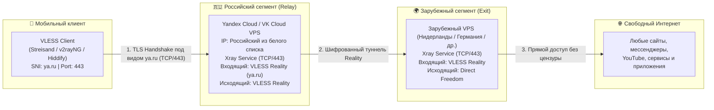

# Whitelist Bypass — Мобильный VPN для обхода «белых списков»

<p align="center">
  
  
  
  
  
</p>

Двухзвенная система туннелирования интернет-трафика, специально спроектированная для стабильной работы мобильного интернета в условиях **режима «белых списков» (allowlist)** операторов сотовой связи в РФ (при чрезвычайных ситуациях, учениях РКН или ограничениях по вышкам/регионам).

---

## 💡 В чем проблема и как это работает?

В режиме «белых списков» мобильные операторы блокируют любой прямой доступ к внешнему интернету, зарубежным IP-адресам, а также стандартным VPN-протоколам (WireGuard, OpenVPN, Shadowsocks, Hysteria 2, TUIC и прямым соединениям VLESS за пределы РФ).

Разрешается только трафик на утвержденный список доверенных российских сервисов (Яндекс, Госуслуги, VK и др.) по протоколу **TCP на порт 443** с проверкой доменного имени (SNI) через системы DPI/ТСПУ.

### Архитектура решения



1. **Первый хоп (Мобильный телефон -> РФ Релей)**: Соединение идет на российский сервер (например, в Yandex Cloud) по **TCP/443**. Для DPI/ТСПУ трафик выглядит как легитимный HTTPS-запрос браузера Chrome к `ya.ru`.
2. **Второй хоп (РФ Релей -> Зарубежный VPS)**: Российский релей принимает трафик и пересылает его через отдельный защищенный туннель VLESS REALITY на зарубежную ноду.
3. **Выход в интернет (Зарубежный VPS -> Мир)**: Трафик выходит в открытый интернет с IP-адреса зарубежного VPS без каких-либо ограничений.

---

## ✨ Ключевые преимущества

- 🛡️ **Полная маскировка (REALITY + XTLS-Vision)**: Трафик неотличим от настоящего TLS 1.3 трафика браузера.
- ⚡ **Низкий оверхед и высокая скорость**: Сквозная маршрутизация потоков без лишней переупаковки.
- 🔒 **Полная изоляция сервисов**: Устанавливается в отдельную директорию `/opt/whitelist-bypass/` с независимыми systemd-юнитами и непривилегированным пользователем `whitelist-bypass`. **Не конфликтует** с уже установленными на серверах панелями (3x-ui, Marzban, Hysteria 2 и др.).
- 👥 **Мульти-клиентность и управление доступом**: Встроенный скрипт управления устройствами (`add-device`, `remove-device`, `list`) с мгновенной генерацией QR-кодов.
- 🤖 **Автоматизация развертывания**: Готовые скрипты установки для Ubuntu 22.04 / 24.04.

---

## 🚀 Быстрый старт

### Требования
1. **Зарубежный VPS** (Германия, Финляндия, Нидерланды и т.д.) с Ubuntu 22.04 / 24.04 и свободным портом `TCP 443`.
2. **Российский VPS** (Yandex Cloud, VK Cloud, Selectel или др. с IP-адресом РФ) с Ubuntu 22.04 / 24.04 и свободным портом `TCP 443`.

---

### Шаг 1: Развертывание Зарубежного сервера (Exit)

Подключитесь по SSH к вашему **зарубежному серверу** и выполните:

```bash
git clone https://github.com/trymyfear/Russia-whitelist-bypass.git /tmp/wlb
cd /tmp/wlb
sudo bash scripts/deploy-foreign.sh
```

В конце выполнения скрипт выведет сгенерированные учетные данные:
```text
FOREIGN_REALITY_PUBLIC_KEY=...
FOREIGN_SHORT_ID=...
HOP_UUID=...
FOREIGN_SNI=www.yahoo.com
```
*Скопируйте эти 4 значения для следующего шага.*

---

### Шаг 2: Развертывание Российского релея (Relay)

Подключитесь по SSH к вашему **российскому серверу** и выполните:

```bash
git clone https://github.com/trymyfear/Russia-whitelist-bypass.git /tmp/wlb
cd /tmp/wlb

# Задайте переменные, полученные с зарубежного сервера, и IP зарубежного VPS:
export FOREIGN_IP="IP_ВАШЕГО_ЗАРУБЕЖНОГО_VPS"
export FOREIGN_REALITY_PUBLIC_KEY="ВАШ_FOREIGN_REALITY_PUBLIC_KEY"
export FOREIGN_SHORT_ID="ВАШ_FOREIGN_SHORT_ID"
export HOP_UUID="ВАШ_HOP_UUID"

# Запустите установку релея
sudo -E bash scripts/deploy-relay.sh
```

Скрипт автоматически:
- Установит актуальный Xray-core;
- Настроит межсетевой экран UFW (разрешит только SSH и TCP/443);
- Сконфигурирует маскировку под `ya.ru`;
- Создаст изолированную службу systemd;
- **Сгенерирует готовую VLESS-ссылку** для импорта в мобильное приложение!

---

### Шаг 3: Подключение на смартфоне

Скопируйте выведенную ссылку `vless://...` и добавьте ее в одно из приложений:

| Платформа | Рекомендуемые клиенты |
|---|---|
| **iOS** | [Streisand](https://apps.apple.com/app/streisand/id6450534064), [V2Box](https://apps.apple.com/app/v2box-v2ray-client/id6446814043), [FoXray](https://apps.apple.com/app/foxray/id6448892567), [Sing-box](https://apps.apple.com/app/sing-box/id6451272673) |
| **Android** | [v2rayNG](https://github.com/2dust/v2rayNG/releases), [NekoBox](https://github.com/MatsuriDayo/NekoBoxForAndroid/releases), [Hiddify](https://github.com/hiddify/hiddify-app/releases) |
| **Windows / macOS** | [v2rayN](https://github.com/2dust/v2rayN/releases), [Nekoray](https://github.com/MatsuriDayo/nekoray/releases), [Hiddify Next](https://github.com/hiddify/hiddify-app/releases) |

*Подробная инструкция по настройке клиентов: [docs/CLIENT_SETUP.md](docs/CLIENT_SETUP.md)*.

---

## 👥 Управление устройствами

Вы можете создавать отдельные ссылки и QR-коды для каждого устройства (смартфон, планшет, родственники/друзья), чтобы управлять доступом и при необходимости отзывать его.

### Через локальный компьютер (PowerShell / Bash)

1. Скопируйте `config.env.example` в `config.env` и укажите IP и параметры вашего релея.
2. Используйте скрипты:

```powershell
# Добавить новое устройство (сгенерирует ссылку и QR-код в artifacts/private/):
.\scripts\add-device.ps1 -Name "phone-friend"

# Посмотреть список всех устройств:
.\scripts\list-devices.ps1

# Отозвать доступ у устройства:
.\scripts\remove-device.ps1 -Name "phone-friend"
```

*Для Linux/macOS доступны аналогичные bash-скрипты: `./scripts/add-device.sh`, `./scripts/list-devices.sh`, `./scripts/remove-device.sh`.*

---

## 📁 Структура репозитория

```text
whitelistbypass/
├── config/
│   └── templates/
│       ├── foreign.json.tmpl       # Шаблон конфигурации Xray для зарубежного выхода
│       └── relay.json.tmpl         # Шаблон конфигурации Xray для РФ релея
├── docs/
│   ├── ARCHITECTURE.md            # Подробный технический разбор работы протоколов и DPI
│   ├── DEPLOYMENT.md              # Пошаговое руководство по развертыванию
│   ├── CLIENT_SETUP.md            # Инструкции по настройке мобильных клиентов
│   └── TROUBLESHOOTING.md         # Диагностика, проверка связности и частые вопросы
├── scripts/
│   ├── add-device.ps1 / .sh       # Добавление клиентского устройства
│   ├── list-devices.ps1 / .sh     # Просмотр активных устройств
│   ├── remove-device.ps1 / .sh    # Удаление устройства
│   ├── configure-relay-firewall.sh# Настройка UFW на релее
│   ├── deploy-foreign.sh          # Автоматический деплой зарубежной ноды
│   ├── deploy-relay.sh            # Автоматический деплой РФ релея
│   ├── install-xray-core.sh       # Установка бинарников Xray-core
│   ├── make-qr.py                 # Генератор QR-кодов
│   ├── run-direct-foreign-test.sh # Тест прямого туннеля между серверами
│   ├── run-e2e-test.sh            # Сквозной end-to-end тест связности
│   └── dns-udp-test.py            # Проверка прохождения UDP DNS
├── systemd/
│   ├── whitelist-bypass-foreign.service # Защищенный systemd-юнит для зарубежного хоста
│   └── whitelist-bypass-relay.service   # Защищенный systemd-юнит для РФ релея
├── config.env.example             # Пример конфигурационного файла с переменными
├── .gitignore                     # Правила исключения приватных данных и ключей
└── README.md                      # Документация проекта
```

---

## 🔒 Безопасность и конфиденциальность

- **Никаких секретов в репозитории**: Все приватные ключи, IP-адреса и сгенерированные файлы хранятся локально в `.secrets/` и `artifacts/private/`, которые надежно исключены через `.gitignore`.
- **Systemd Sandboxing**: Сервисы запускаются с ограниченными правами (`ProtectSystem=strict`, `ProtectHome=true`, `NoNewPrivileges=true`, `LimitNOFILE=1048576`).
- **Собственный сервис**: Не затрагивает системный софт и сторонние панели управления.

---

## 📚 Дополнительная документация

- 📖 [Архитектура и принцип работы белых списков](docs/ARCHITECTURE.md)
- 🛠️ [Подробное руководство по развертыванию](docs/DEPLOYMENT.md)
- 📱 [Настройка приложений для iOS и Android](docs/CLIENT_SETUP.md)
- 🔍 [Диагностика и устранение неполадок](docs/TROUBLESHOOTING.md)

---

## 📄 Лицензия

Проект распространяется под свободной лицензией [MIT](LICENSE).
